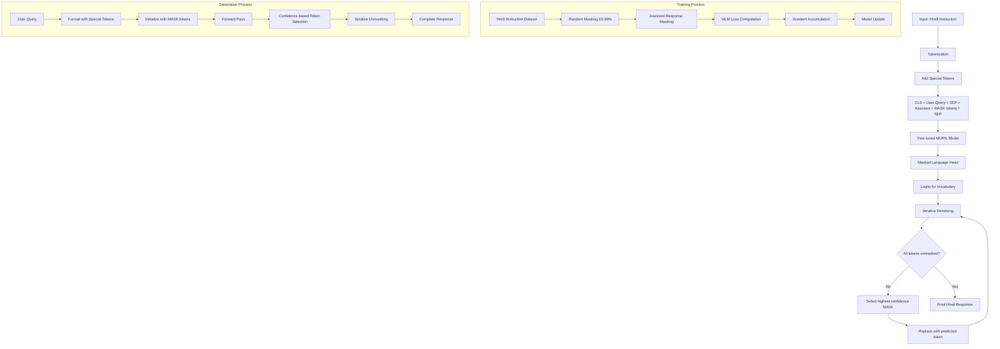

# HinDiffusion Language Model

A masked language model fine-tuned for Hindi instruction-following using diffusion-based text generation

## 🎯 Overview

This project fine-tunes pre-trained BERT-based models on Hindi instruction data using a masked language modeling approach with diffusion-style generation. The model learns to iteratively denoise masked tokens to generate coherent responses in Hindi.

## 🏗️ Architecture



## ✨ Features

- **Hindi Language Support**: Specialized for Hindi instruction-following tasks
- **Diffusion-based Generation**: Novel iterative denoising approach for text generation
- **Memory Optimized Training**: Gradient accumulation and checkpointing for efficient training
- **Interactive Demo**: Gradio-based web interface with real-time visualization
- **Flexible Architecture**: Easy to adapt for different languages and datasets

## 🚀 Quick Start

### Prerequisites

```bash
pip install torch transformers datasets accelerate
pip install gradio tqdm numpy
```

### Model Usage

```python
from transformers import AutoTokenizer, AutoModelForMaskedLM
import torch

# Load the model
model_id = "mnkbcs22021/modernbert-diffusion"
tokenizer = AutoTokenizer.from_pretrained(model_id)
model = AutoModelForMaskedLM.from_pretrained(model_id)

# Generation function
def generate_hindi_response(question, max_length=32):
    prompt = f"User: {question} {tokenizer.sep_token} Assistant:"
    prompt_ids = tokenizer.encode(prompt, add_special_tokens=False)
    
    # Initialize with MASK tokens
    ids = ([tokenizer.cls_token_id] + prompt_ids + 
           [tokenizer.sep_token_id] + [tokenizer.mask_token_id] * max_length + 
           [tokenizer.sep_token_id])
    
    # Iterative denoising
    with torch.no_grad():
        for i in range(max_length):
            logits = model(input_ids=torch.tensor([ids])).logits
            probs = torch.softmax(logits[0], dim=-1)
            
            # Find MASK positions
            mask_positions = [j for j, token_id in enumerate(ids) 
                            if token_id == tokenizer.mask_token_id]
            if not mask_positions:
                break
                
            # Select highest confidence prediction
            best_pos = max(mask_positions, 
                          key=lambda pos: probs[pos].max().item())
            ids[best_pos] = probs[best_pos].argmax().item()
    
    return tokenizer.decode(ids, skip_special_tokens=True)

# Example usage
response = generate_hindi_response("भारत की राजधानी क्या है?")
print(response)
```


## 📊 Experiments

### Models Evaluated

| Model | Performance | Status | Notes |
|-------|-------------|--------|-------|
| `google/muril-base-cased` | ✅ **Best** | Working | Optimal balance of performance and efficiency |
| `google/muril-large-cased` | ❌ Poor | Failed | Memory constraints, slower convergence |
| `ai4bharat/indic-bert` | ⚠️ Moderate | Partial | Decent but inferior to MURIL-base |

### Datasets Tested

| Dataset | Subset | Status | Training Time | Notes |
|---------|--------|--------|---------------|-------|
| `ai4bharat/indic-instruct-data-v0.1` | `anudesh` | ✅ **Used** | ~2 hours | Primary dataset for demonstration |
| `ai4bharat/indic-instruct-data-v0.1` | `lm_sys` | ⚠️ Skipped | >8 hours | Too time-intensive for demo |

### Training Configuration

```yaml
Model: google/muril-base-cased
Dataset: ai4bharat/indic-instruct-data-v0.1 (anudesh subset)
Hardware: Kaggle T4 x2 GPUs
Batch Size: 4 (with 8x gradient accumulation)
Effective Batch Size: 32
Learning Rate: 2e-4
Max Sequence Length: 256
Masking Ratio: 15-99% (random)
Training Duration: 1 epoch
Memory Optimizations:
  - Gradient checkpointing
  - bfloat16 precision
  - Gradient accumulation
  - Subset sampling (10k examples)
```


### Hyperparameter Tuning

```python
# Adjustable parameters
max_len = 512                    # Sequence length
mask_ratio_min = 0.10           # Minimum masking ratio
mask_ratio_max = 0.80           # Maximum masking ratio
learning_rate = 1e-4            # Learning rate
batch_size = 8                  # Per-device batch size
accumulation_steps = 4          # Gradient accumulation
```


## 🙏 Acknowledgments

- **AI4Bharat** for the Hindi instruction dataset
- **Google Research** for the MURIL model
- **Hugging Face** for the transformers library
- **Kaggle** for providing free GPU resources

## 🔗 Links

- **Model on Hugging Face**: `mnkbcs22021/modernbert-diffusion`
- **Dataset**: `ai4bharat/indic-instruct-data-v0.1`
- **Base Model**: `google/muril-base-cased`
